Lesson 2 - Force and Its Representation

-   Meaning of Force

-   [Force
    Types](https://www.physicsclassroom.com/class/newtlaws/Lesson-2/Types-of-Forces)

-   [Drawing Free-Body
    Diagrams](https://www.physicsclassroom.com/class/newtlaws/Lesson-2/Drawing-Free-Body-Diagrams)

-   [Meaning of Net
    Force](https://www.physicsclassroom.com/class/newtlaws/Lesson-2/Determining-the-Net-Force)

# The Meaning of Force

A **force** is a push or pull upon an object resulting from the
object\'s interaction with another object. Whenever there is
an interaction between two objects, there is a force upon each of the
objects. When the interaction ceases, the two objects no longer
experience the force. Forces [only]{.underline} exist as a result of an
interaction.\
\
\
\
 **Contact versus Action-at-a-Distance Forces**

For simplicity sake, all forces (interactions) between objects can be
placed into two broad categories:

-   contact forces, and

-   forces resulting from action-at-a-distance

**Contact forces** are those types of forces that result when the two
interacting objects are perceived to be physically contacting each
other. Examples of contact forces include frictional forces, tensional
forces, normal forces, air resistance forces, and applied forces.

**Action-at-a-distance forces** are those types of forces that result
even when the two interacting objects are not in physical contact with
each other, yet are able to exert a push or pull despite their physical
separation. Examples of action-at-a-distance forces include
gravitational forces. For example, the sun and planets exert
a [[gravitational
pull]{.underline}](http://www.physicsclassroom.com/Class/circles/u6l3c.cfm) on
each other despite their large spatial separation. Even when your feet
leave the earth and you are no longer in physical contact with the
earth, there is a gravitational pull between you and the Earth. Electric
forces are action-at-a-distance forces. For example, the protons in the
nucleus of an atom and the electrons outside the nucleus experience an
electrical pull towards each other despite their small spatial
separation. And magnetic forces are action-at-a-distance forces. For
example, two magnets can exert a magnetic pull on each other even when
separated by a distance of a few centimeters

Examples of contact and action-at-distance forces are listed in the
table below.

  -----------------------------------------------------------------------
  **Contact Forces**             **Action-at-a-Distance Forces**
  ------------------------------ ----------------------------------------
  Frictional Force               Gravitational Force

  Tension Force                  Electrical Force

  Normal Force                   Magnetic Force

  Air Resistance Force            

  Applied Force                   

  Spring Force                    
  -----------------------------------------------------------------------

 

 

### 

### 

### 

### **The Newton**

Force is a quantity that is measured using the standard metric unit
known as the **Newton**. A Newton is abbreviated by an \"N.\" To say
\"10.0 N\" means 10.0 Newton of force. One Newton is the amount of force
required to give a 1-kg mass an acceleration of 1 m/s/s. Thus, the
following unit equivalency can be stated:

**1 Newton = 1 kg • m/s2**

**Force is a Vector Quantity**

A force is a vector quantity. [[As learned in an earlier
unit]{.underline}](http://www.physicsclassroom.com/Class/1DKin/U1L1b.cfm),
a vector quantity is a quantity that has both magnitude and direction.
To fully describe the force acting upon an object, you must describe
both the magnitude (size or numerical value) and the direction. Thus, 10
Newton is not a full description of the force acting upon an object. In
contrast, 10 Newton, downward is a complete description of the force
acting upon an object; both the magnitude (10 Newton) and the direction
(downward) are given.

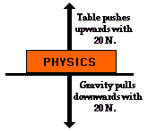Because a force is a vector that has a
direction, it is common to represent forces using diagrams in which a
force is represented by an arrow. Such vector diagrams were
introduced [[in an earlier
unit]{.underline}](http://www.physicsclassroom.com/Class/1DKin/U1L2c.cfm) and
are used throughout the study of physics. The size of the arrow is
reflective of the magnitude of the force and the direction of the arrow
reveals the direction that the force is acting. (Such diagrams are known
as free-body diagrams and are discussed [[later in this
lesson]{.underline}](http://www.physicsclassroom.com/Class/newtlaws/u2l2c.cfm).)
Furthermore, because forces are vectors, the effect of an individual
force upon an object is often canceled by the effect of another force.
For example, the effect of a 20-Newton upward force acting upon a book
is canceled by the effect of a 20-Newton downward force acting upon the
book. In such instances, it is said that the two individual
forces balance each other; there would be no [[unbalanced
force]{.underline}](http://www.physicsclassroom.com/Class/newtlaws/u2l1d.cfm#balanced) acting
upon the book.

 

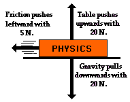Other situations could be imagined in which two
of the individual vector forces cancel each other (\"balance\"), yet a
third individual force exists that is not balanced by another force. For
example, imagine a book sliding across the rough surface of a table from
left to right. The downward force of gravity and the upward force of the
table supporting the book act in opposite directions and thus balance
each other. However, the force of friction acts leftwards, and there is
no rightward force to balance it. In this case, an [[unbalanced
force]{.underline}](http://www.physicsclassroom.com/Class/newtlaws/u2l1d.cfm#balanced) acts
upon the book to change its [[state of
motion]{.underline}](http://www.physicsclassroom.com/Class/newtlaws/u2l1c.cfm#state).

# Types of Forces

+-------------+--------------------------------------------------------+
| **Type of   | **Description of Force**                               |
| Force**     |                                                        |
|             |                                                        |
| **(and      |                                                        |
| Symbol)**   |                                                        |
+=============+========================================================+
| ### ** **   | An applied force is a force that is applied to an      |
|             | object by a person or another object. If a person is   |
| **Applied   | pushing a desk across the room, then there is an       |
| Force**     | applied force acting upon the object. The applied      |
|             | force is the force exerted on the desk by the person.  |
| ### *       |                                                        |
| *  F***app* |                                                        |
+-------------+--------------------------------------------------------+
| ### ** **   | The force of gravity is the force with which the       |
|             | earth, moon, or other massively large object attracts  |
| **Gravity   | another object towards itself. By definition, this is  |
| Force**     | the weight of the object. All objects upon earth       |
|             | experience a force of gravity that is directed         |
| **(also     | \"downward\" towards the center of the earth. The      |
| known as    | force of gravity on earth is always equal to the       |
| Weight)**   | weight of the object as found by the equation:         |
|             |                                                        |
| **F***grav* | **Fgrav = m \* g**                                     |
|             |                                                        |
|             | where g = 9.8 N/kg (on Earth)n and m = mass (in kg)    |
+-------------+--------------------------------------------------------+
| **Normal    | The normal force is the support force exerted upon an  |
| Force**     | object that is in contact with another stable object.  |
|             | For example, if a book is resting upon a surface, then |
| ### **      | the surface is exerting an upward force upon the book  |
|   F***norm* | in order to support the weight of the book. On         |
|             | occasions, a normal force is exerted horizontally      |
|             | between two objects that are in contact with each      |
|             | other. For instance, if a person leans against a wall, |
|             | the wall pushes horizontally on the person.            |
+-------------+--------------------------------------------------------+
| **Friction  | The friction force is the force exerted by a surface   |
| Force**     | as an object moves across it or makes an effort to     |
|             | move across it. There are at least two types of        |
| ### **      | friction force - sliding and static friction. Though   |
|  F***frict* | it is not always the case, the friction force often    |
|             | opposes the motion of an object. For example, if a     |
|             | book slides across the surface of a desk, then the     |
|             | desk exerts a friction force in the opposite direction |
|             | of its motion. Friction results from the two surfaces  |
|             | being pressed together closely, causing intermolecular |
|             | attractive forces between molecules of different       |
|             | surfaces. As such, friction depends upon the nature of |
|             | the two surfaces and upon the degree to which they are |
|             | pressed together. The maximum amount of friction force |
|             | that a surface can exert upon an object can be         |
|             | calculated using the formula below:                    |
|             |                                                        |
|             | Ffrict = µ • Fnorm                                     |
+-------------+--------------------------------------------------------+
| **Air       | The air resistance is a special type of frictional     |
| Resistance  | force that acts upon objects as they travel through    |
| Force**     | the air. The force of air resistance is often observed |
|             | to oppose the motion of an object. This force will     |
| ### *       | frequently be neglected due to its negligible          |
| *  F***air* | magnitude (and due to the fact that it is              |
|             | mathematically difficult to predict its value). It is  |
|             | most noticeable for objects that travel at high speeds |
|             | (e.g., a skydiver or a downhill skier) or for objects  |
|             | with large surface areas.                              |
+-------------+--------------------------------------------------------+
| **Tension   | The tension force is the force that is transmitted     |
| Force**     | through a string, rope, cable or wire when it is       |
|             | pulled tight by forces acting from opposite ends. The  |
| **F***tens* | tension force is directed along the length of the wire |
|             | and pulls equally on the objects on the opposite ends  |
|             | of the wire.                                           |
+-------------+--------------------------------------------------------+
| **Spring    | The spring force is the force exerted by a compressed  |
| Force**     | or stretched spring upon any object that is attached   |
|             | to it. An object that compresses or stretches a spring |
| ### **      | is always acted upon by a force that restores the      |
| F***spring* | object to its rest or equilibrium position. For most   |
|             | springs (specifically, for those that are said to obey |
|             | \"[[Hooke\'s                                           |
|             | Law]{.underline}](http://w                             |
|             | ww.physicsclassroom.com/Class/waves/u10l0d.cfm#p2)\"), |
|             | the magnitude of the force is directly proportional to |
|             | the amount of stretch or compression of the spring.    |
+-------------+--------------------------------------------------------+

### **Sliding versus Static Friction**

The friction force is the force exerted by a surface as an object moves
across it or makes an effort to move across it. For the purpose of our
study of physics at The Physics Classroom, there are two types of
friction force - static friction and sliding friction. **Sliding
friction** results when an object slides across a surface. As an
example, consider pushing a box across a floor. The floor surface offers
resistance to the movement of the box. We often say that the floor
exerts a friction force upon the box. This is an example of a sliding
friction force since it results from the sliding motion of the box. If a
car slams on its brakes and skids to a stop (without antilock brakes),
there is a sliding friction force exerted upon the car tires by the
roadway surface. This friction force is also a sliding friction force
because the car is sliding across the road surface. Sliding friction
forces can be calculated from knowledge of the coefficient of friction
and the normal force exerted upon the object by the surface it is
sliding across. The formula is:

**Ffrict-sliding = μfrict-sliding • Fnorm**

The symbol **μfrict-sliding** represents the **coefficient of sliding
friction** between the two surfaces. The coefficient value is dependent
primarily upon the nature of the surfaces that are in contact with each
other. For most surface combinations, the friction coefficients show
little dependence upon other variables such as area of contact,
temperature, etc. Values of **μsliding** have been experimentally
determined for a variety of surface combinations and are often tabulated
in technical manuals and handbooks. The values of **μ** provide a
measure of the relative amount of adhesion or attraction of the two
surfaces for each other. The more that surface molecules tend to adhere
to each other, the greater the coefficient values and the greater the
friction force.

Friction forces can also exist when the two surfaces are not sliding
across each other. Such friction forces are referred to as static
friction. **Static friction** results when the surfaces of two objects
are at rest relative to one another and a force exists on one of the
objects to set it into motion relative to the other object. Suppose you
were to push with 5-Newton of force on a large box to move it across the
floor. The box might remain in place. A static friction force exists
between the surfaces of the floor and the box to prevent the box from
being set into motion. The static friction force balances the force that
you exert on the box such that the stationary box remains at rest. When
exerting 5 Newton of applied force on the box, the static friction force
has a magnitude of 5 Newton. Suppose that you were to push with 25
Newton of force on the large box and the box were to still remain in
place. Static friction now has a magnitude of 25 Newton. Then suppose
that you were to increase the force to 26 Newton and the box
finally budged from its resting position and was set into motion across
the floor. The box-floor surfaces were able to provide up to 25 Newton
of static friction force to match your applied force. Yet the two
surfaces were not able to provide 26 Newton of static friction force.
The amount of static friction resulting from the adhesion of any two
surfaces has an upper limit. In this case, the static friction force
spans the range from 0 Newton (if there is no force upon the box) to 25
Newton (if you push on the box with 25 Newton of force). This
relationship is often expressed as follows:

**Ffrict-static ≤ μfrict-static• Fnorm**

The symbol **μfrict-static** represents the **coefficient of static
friction** between the two surfaces. Like the coefficient of sliding
friction, this coefficient is dependent upon the types of surfaces that
are attempting to move across each other. In general, values of static
friction coefficients are greater than the values of sliding friction
coefficients for the same two surfaces. Thus, it typically takes more
force to budge an object into motion than it does to maintain the motion
once it has been started.

 

The meaning of each of these forces listed in the table above will have
to be thoroughly understood to be successful during this unit.
Ultimately, you must be able to read a verbal description of a physical
situation and know enough about these forces to recognize their presence
(or absence) and to construct a free-body diagram that illustrates their
relative magnitude and direction.

1\. Complete the following table showing the relationship between mass
and weight. 

  -----------------------------------------------------------------------
  **Object**              **Mass (kg)**           **Weight (N)**
  ----------------------- ----------------------- -----------------------
  Melon                   1 kg                    

  Apple                                           0.98 N

  Pat Eatladee            25 kg                   

  Fred                                            980 N
  -----------------------------------------------------------------------

**Answer:**

**Mass (kg)**

Apple: **0.1 kg** (or \~0.098 kg if approximating **g** to be 10 m/s/s)

Fred: **100 kg** (or \~98 kg if approximating **g** to be 10 m/s/s)

**Weight (N)**

Melon: **9.8 N** (or \~10 N if approximating **g** to be 10 m/s/s)

Pat Eatladee: **245 N** (or \~250 N if approximating **g** to be 10
m/s/s)

2\. Different masses are hung on a spring scale calibrated in Newtons.

a.  The force exerted by gravity on 1 kg = 9.8 N.

b.  The force exerted by gravity on 5 kg = \_\_\_\_\_\_ N.

c.  The force exerted by gravity on \_\_\_\_\_\_\_ kg = 98 N.

d.  The force exerted by gravity on 70 kg = \_\_\_\_\_\_\_\_ N.

b. **49 N** (\~50 N if approximating **g** to be 10 m/s/s)

c. **10 kg** (\~9.8 kg if approximating **g** to be 10 m/s/s)

d. **686 N** (\~700 N if approximating **g** to be 10 m/s/s)

.3. When a person diets, is their goal to lose mass or to lose weight?
Explain.

Generally, people diet because they wish to reduce the amount of matter
on their body - they wish to remove the *blubber*. So people diet **to
lose mass**. If one wishes to lose weight, they could get a six fold
reduction by moving to the moon. Groovy

# 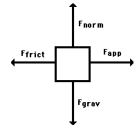Drawing Free-Body Diagrams

Free-body diagrams are diagrams used to show the relative magnitude and
direction of all forces acting upon an object in a given situation. A
free-body diagram is a special example of the vector diagrams that were
discussed [[in an earlier
unit]{.underline}](http://www.physicsclassroom.com/Class/1DKin/U1L2c.cfm).
These diagrams will be used throughout our study of physics. The size of
the arrow in a free-body diagram reflects the magnitude of the force.
The direction of the arrow shows the direction that the force is acting.
Each force arrow in the diagram is labeled to indicate the exact type of
force. It is generally customary in a free-body diagram to represent the
object by a box and to draw the force arrow from the center of the box
outward in the direction that the force is acting. An example of a
free-body diagram is shown at the right

The free-body diagram above depicts four forces acting upon the object.
Objects do [not]{.underline} necessarily always have four forces acting
upon them. There will be cases in which the number of forces depicted by
a free-body diagram will be one, two, or three. There is no hard and
fast rule about the number of forces that must be drawn in a free-body
diagram. The only *rule* for drawing free-body diagrams is to depict all
the forces that exist for that object in the given situation. Thus, to
construct free-body diagrams, it is extremely important to know
the [[various types of
forces]{.underline}](http://www.physicsclassroom.com/Class/newtlaws/u2l2b.cfm#Top).
If given a description of a physical situation, begin by using your
understanding of the force types to identify which forces are present.
Then determine the direction in which each force is acting. Finally,
draw a box and add arrows for each existing force in the appropriate
direction; label each force arrow according to its type. If necessary,
refer to [[the list of forces and their
description]{.underline}](http://www.physicsclassroom.com/Class/newtlaws/u2l2b.cfm#Help) in
order to understand the various force types and their appropriate
symbols.

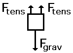Ex.

A gymnast holding onto a bar, is suspended motionless in mid-air. The
bar is supported by two ropes that attach to the ceiling. Diagram the
forces acting on the combination of gymnast and bar. A free-body diagram
for this situation looks like this:

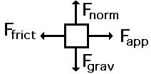 A rightward force is applied to a book in order
to move it across a desk at constant velocity. Consider frictional
forces. Neglect air resistance. A free-body diagram for this situation
looks like this:

 

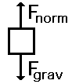1. A book is at rest on a tabletop. A free-body
diagram for this situation looks like this:

 

2. A gymnast holding onto a bar, is suspended
motionless in mid-air. The bar is supported by two ropes that attach to
the ceiling. Diagram the forces acting on the combination of gymnast and
bar. A free-body diagram for this situation looks like this:

 

3\. An egg is free-falling from a nest in a tree. Neglect air
resistance. A free-body diagram for this situation looks like this:

 

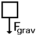

 

4\. A flying squirrel is gliding (no wing flaps) from a tree to the
ground at constant velocity. Consider air resistance. A free-body
diagram for this situation looks like this:

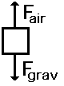

 

5\. A rightward force is applied to a book in order to move it across a
desk with a rightward acceleration. Consider frictional forces. Neglect
air resistance. A free-body diagram for this situation looks like this:

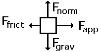

 

6\. A rightward force is applied to a book in order to move it across a
desk at constant velocity. Consider frictional forces. Neglect air
resistance. A free-body diagram for this situation looks like this:

 

 

7\. A college student rests a backpack upon his shoulder. The pack is
suspended motionless by one strap from one shoulder. A free-body diagram
for this situation looks like this:

 

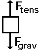 

8\. A skydiver is descending with a constant velocity. Consider air
resistance. A free-body diagram for this situation looks like this:

 

 

9\. A force is applied to the right to drag a sled across loosely packed
snow with a rightward acceleration. Neglect air resistance. A free-body
diagram for this situation looks like this:

 

 

10\. A football is moving upwards towards its peak after having
been booted by the punter. Neglect air resistance. A free-body diagram
for this situation looks like this:

 

11\. A car is coasting to the right and slowing down. Neglect air
resistance. A free-body diagram for this situation looks like this:

 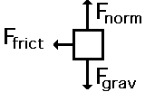

# Determining the Net Force

In the statement of Newton\'s first law, the unbalanced force refers to
that force that does not become completely balanced (or canceled) by the
other individual forces. If either all the vertical forces (up and down)
do not cancel each other and/or all horizontal forces do not cancel each
other, then an unbalanced force exists. The existence of an unbalanced
force for a given situation can be quickly realized by looking at the
free-body diagram for that situation. Free-body diagrams for three
situations are shown below. Note that the actual magnitudes of the
individual forces are indicated on the diagram.

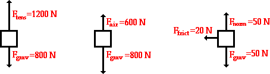

 

In each of the above situations, there is an unbalanced force. It is
commonly said that in each situation there is a net force acting upon
the object. The [net force]{.underline} is the vector sum of all the
forces that act upon an object. That is to say, the net force is the sum
of all the forces, taking into account the fact that a force is a vector
and two forces of equal magnitude and opposite direction will cancel
each other out. At this point, the rules for summing vectors (such as
force vectors) will be kept relatively simple. Observe the following
examples of summing two forces:

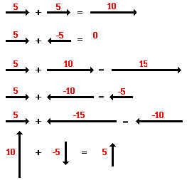

 

Observe in the diagram above that a downward vector will provide a
partial or full cancellation of an upward vector. And a leftward vector
will provide a partial or full cancellation of a rightward vector. The
addition of force vectors can be done in the same manner in order to
determine the net force (i.e., the vector sum of all the individual
forces). Consider the three situations below in which the net force is
determined by summing the individual force vectors that are acting upon
the objects.

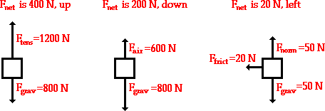

### **A Net Force Causes an Acceleration**

A net force (i.e., an unbalanced force) causes an acceleration. In a
previous unit, several means of representing accelerated motion
(position-time and velocity-time graphs, ticker tape diagrams,
velocity-time data, etc.) were discussed. Combine your understanding of
acceleration and the newly acquired knowledge that a net force causes an
acceleration to determine whether or not a net force exists in the
following situations.

**Description of Motion**

 

Yes! There is a net force since there is an acceleration.

No! There is no net force since there is not an acceleration.

Yes! There is a net force since there is an acceleration

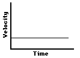

No! There is a no net force since there is not an acceleration (zero
slope on a v-t graph means zero acceleration).

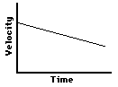

Yes! There is a net force since there is an acceleration (the slope on a
v-t graph means acceleration).

Yes! There is a net force since there is an acceleration (the slope on a
v-t graph means acceleration).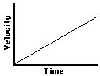

1\. Free-body diagrams for four situations are shown below. For each
situation, determine the net force acting upon the object. Click the
buttons to view the answers.

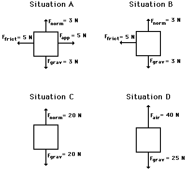**Answer**

**Situation A:**The net force is **zero Newtons**. All the individual
forces balance each other (i.e., cancel each other out).

**Situation B:**The net force is **5 Newtons, left**. The vertical
forces balance each other (i.e., cancel each other out). The leftward
force (friction) remains unbalanced.

**Situation C:**The net force is **zero Newtons**. All the individual
forces balance each other (i.e., cancel each other out).

**Situation D:**The net force is **15 Newtons, up**. The upward force of
air resistance is only partially balanced by the downward force of
gravity - 15 N of upward force remains unbalanced.

2\. Free-body diagrams for four situations are shown below. The net
force is known for each situation. However, the magnitudes of a few of
the individual forces are not known. Analyze each situation individually
and determine the magnitude of the unknown forces. Then click the button
to view the answers.

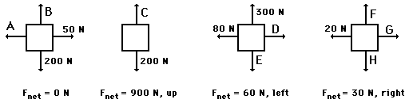**Answer**

**A = 50 N** (the horizontal forces must be balanced)

**B = 200 N** (the vertical forces must be balanced)

**C = 1100 N** (in order to have a net force of 200 N, up)

**D = 20 N** (in order to have a net force of 60 N, left)

**E = 300 N** (the vertical forces must be balanced)

**F = H = any number** you wish (as long as F equals H)

**G = 50 N** (in order to have a net force of 30 N, right)

Lesson 3 - Newton\'s Second Law of Motion

-   Newton\'s Second Law

-   [The Big
    Misconception](https://www.physicsclassroom.com/class/newtlaws/Lesson-3/The-Big-Misconception)

-   [Finding
    Acceleration](https://www.physicsclassroom.com/class/newtlaws/Lesson-3/Finding-Acceleration)

-   [Finding Individual Force
    Values](https://www.physicsclassroom.com/class/newtlaws/Lesson-3/Finding-Individual-Forces)

-   [Free Fall and Air
    Resistance](https://www.physicsclassroom.com/class/newtlaws/Lesson-3/Free-Fall-and-Air-Resistance)

-   [Two-Body
    Problems](https://www.physicsclassroom.com/class/newtlaws/Lesson-3/Double-Trouble)

# 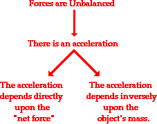Newton\'s Second Law

Newton\'s second law of motion pertains to the behavior of objects for
which all existing forces are [not]{.underline} balanced. The second law
states that the acceleration of an object is dependent upon two
variables - the [[net
force]{.underline}](http://www.physicsclassroom.com/Class/newtlaws/u2l2d.cfm) acting
upon the object and the mass of the object. The acceleration of an
object depends directly upon the net force acting upon the object, and
inversely upon the mass of the object. As the force acting upon an
object is increased, the acceleration of the object is increased. As the
mass of an object is increased, the acceleration of the object is
decreased.

### **The BIG Equation**

Newton\'s second law of motion can be formally stated as follows:

The acceleration of an object as produced by a net force is directly
proportional to the magnitude of the net force, in the same direction as
the net force, and inversely proportional to the mass of the object.

### 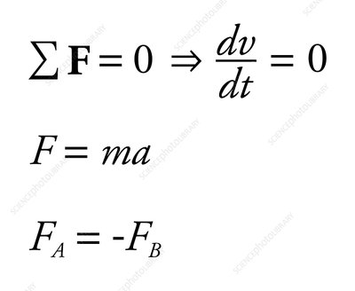**Formula:**

This verbal statement can be expressed in equation form as follows:

**a = Fnet / m**

The above equation is often rearranged to a more familiar form as shown
below. The net force is equated to the product of the mass times the
acceleration.

**Fnet = m • a**

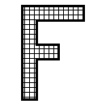In this entire discussion, the emphasis has been
on the net force. The acceleration is directly proportional to the net
force; the net force equals mass times acceleration; the acceleration in
the same direction as the net force; an acceleration is produced by
a net force. The NET FORCE. It is important to remember this
distinction. Do not use the value of merely \"any \'ole force\" in the
above equation. It is the net force that is related to
acceleration. [[As discussed in an earlier
lesson]{.underline}](http://www.physicsclassroom.com/Class/newtlaws/u2l2d.cfm#net),
the net force is the vector sum of all the forces. If all the individual
forces acting upon an object are known, then the net force can be
determined. If necessary, review this principle by returning to
the [[practice questions in Lesson
2]{.underline}](http://www.physicsclassroom.com/Class/newtlaws/u2l2d.cfm#Practice).

 

Consistent with the above equation, a unit of force is equal to a unit
of mass times a unit of acceleration. By substituting standard metric
units for force, mass, and acceleration into the above equation, the
following unit equivalency can be written.

**1 Newton = 1 kg • m/s2**

The definition of the standard metric unit of force is stated by the
above equation. One Newton is defined as the amount of force required to
give a 1-kg mass an acceleration of 1 m/s/s.

### **Your Turn to Practice**

The Fnet = m • a equation is often used in algebraic problem solving.
The table below can be filled by substituting into the equation and
solving for the unknown quantity. Try it yourself and then use the click
on the buttons to view the answers.\
 

+---+-----------------------+-----------+------------------------------+
|   | **Net Force**         | **Mass**  | **Acceleration**             |
|   |                       |           |                              |
|   | **(N)**               | **(kg)**  | **(m/s/s)**                  |
+===+=======================+===========+==============================+
| 1 | 10                    | 2         | ** 5 **                      |
| \ |                       |           |                              |
| . |                       |           |                              |
+---+-----------------------+-----------+------------------------------+
| 2 | 20                    | 2         | ** 10**                      |
| \ |                       |           |                              |
| . |                       |           |                              |
+---+-----------------------+-----------+------------------------------+
| 3 | 20                    | 4         | ** 5 **                      |
| \ |                       |           |                              |
| . |                       |           |                              |
+---+-----------------------+-----------+------------------------------+
| 4 | **10**                | 2         | 5                            |
| \ |                       |           |                              |
| . |                       |           |                              |
+---+-----------------------+-----------+------------------------------+
| 5 | 10                    | ** 1**    | 10                           |
| \ |                       |           |                              |
| . |                       |           |                              |
+---+-----------------------+-----------+------------------------------+

### **Answer**

1.   **a = 5 m/s/s**

> a = Fnet / m
>
> a = (10 N) / (2 kg)
>
> a = 5 m/s/s

2.   **a = 10 m/s/s**

> a = Fnet / m
>
> a = (20 N) / (2 kg)
>
> a = 10 m/s/s

3.   **a = 5 m/s/s**

> a = Fnet / m
>
> a = (20 N) / (4 kg)

4.   **Fnet = 10 N**

> Fnet = m • a
>
> Fnet = (2 kg) • (5 m/s/s)
>
> Fnet = 10 N
>
> a = 5 m/s/s

5.   **m = 1 kg**

> m = Fnet / a
>
> m = (10 N) / (10 m/s/s)
>
> m = 1 kg

1\. Determine the accelerations that result when a 12-N net force is
applied to a 3-kg object and then to a 6-kg object.\
 A 3-kg object experiences an acceleration of **4 m/s/s**. A 6-kg object
experiences an acceleration of **2 m/s/s**.

2\. A net force of 15 N is exerted on an encyclopedia to cause it to
accelerate at a rate of 5 m/s2. Determine the mass of the encyclopedia.\
 Use Fnet= m \* a with Fnet = 15 N and a = 5 m/s/s.

So (15 N) = (m)\*(5 m/s/s)

And **m = 3.0 kg**

3\. Suppose that a sled is accelerating at a rate of 2 m/s2. If the net
force is tripled and the mass is doubled, then what is the new
acceleration of the sled?\
 Answer: **3 m/s/s**

The original value of 2 m/s/s must be multiplied by 3 (since a and F are
directly proportional) and divided by 2 (since a and m are inversely
proportional)

3.  Suppose that a sled is accelerating at a rate of 2 m/s2. If the net
    force is tripled and the mass is halved, then what is the new
    acceleration of the sled?

Answer: **12 m/s/s**

The original value of 2 m/s/s must be multiplied by 3 (since a and F are
directly proportional) and divided by 1/2 (since a and m are inversely
proportional)

# Finding Acceleration

 In this lesson, we will learn how to determine the acceleration of an
object if the magnitudes of all the individual forces are known. The
three major equations that will be useful are the equation for net force
([[Fnet =
m•a]{.underline}](http://www.physicsclassroom.com/Class/newtlaws/u2l3a.cfm)),
the equation for [[gravitational
force]{.underline}](http://www.physicsclassroom.com/Class/newtlaws/u2l2b.cfm#grav) (Fgrav =
m•g), and the equation for [[frictional
force]{.underline}](http://www.physicsclassroom.com/Class/newtlaws/u2l2b.cfm#frict) (Ffrict =
μ • Fnorm).

The process of determining the acceleration of an object demands that
the mass and the net force are known. If mass (m) and net force (Fnet)
are known, then the acceleration is determined by use of the equation.

**a = Fnet / m**

### **EXAMPLES:**

An applied force of 50 N is used to accelerate an object to the right
across a frictional surface. The object encounters 10 N of friction. Use
the diagram to determine the normal force, the net force, the mass, and
the acceleration of the object. (Neglect air resistance.)

Note: To simplify calculations, an approximated value of g is often
used - 10 m/s/s. Answers obtained using this approximation are shown in
parenthesis.

 

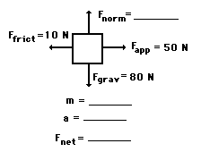**Fnorm = 80 N; m = 8.16 kg; Fnet = 40 N, right;
a = 4.9 m/s/s, right**

( Fnorm = 80 N; m = 8 kg; Fnet = 40 N, right; a = 5 m/s/s, right )

Since there is no vertical acceleration, normal force = gravity force.

The mass can be found using the equation Fgrav = m • g.

The Fnet is the vector sum of all the forces: 80 N, up plus 80 N, down
equals 0 N. And 50 N, right plus 10 N, left = 40 N, right.

Finally, a = Fnet / m = (40 N) / (8.16 kg) = 4.9 m/s/s.

An applied force of 20 N is used to accelerate an object to the right
across a frictional surface. The object encounters 10 N of friction. Use
the diagram to determine the normal force, the net force, the
coefficient of friction (μ) between the object and the surface, the
mass, and the acceleration of the object. (Neglect air resistance.)

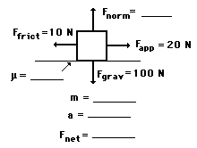**Fnorm = 100 N; m = 10.2 kg; Fnet = 10 N,
right; \"mu\" = 0.1; a =0.980 m/s/s, right**

( Fnorm = 100 N; m = 10 kg; Fnet = 10 N, right; \"mu\" = 0.1; a =1
m/s/s, right )

Since there is no vertical acceleration, the normal force is equal to
the gravity force.

The mass can be found using the equation Fgrav = m \* g.

Using \"mu\" = Ffrict / Fnorm, \"mu\" = (10 N) / (100 N) = 0.1.

The Fnet is the vector sum of all the forces: 100 N, up plus 100 N, down
equals 0 N. And 20 N, right plus 10 N, left = 10 N, right.

Finally, a = Fnet / m = (10 N) / (10.2 kg) = 0.980 m/s/s.

A 5-kg object is sliding to the right and encountering a friction force
that slows it down. The coefficient of friction (μ) between the object
and the surface is 0.1. Determine the force of gravity, the normal
force, the force of friction, the net force, and the acceleration.
(Neglect air resistance.)

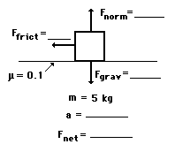**Fgrav = 49 N; Fnorm = 49 N; Ffrict = 4.9 N;
Fnet = 5 N, left; a = 0.98 m/s/s, left**

**( Fgrav = 50 N; Fnorm = 50 N; Ffrict = 5 N; Fnet = 5 N, left; a = 1
m/s/s, left )**

Fgrav = m • g = (5 kg) • (9.8 m/s/s) = 49 N.

Since there is no vertical acceleration, the normal force equals the
gravity force.

Ffrict can be found using the equation Ffrict =\"mu\"• Fnorm.

The Fnet is the vector sum of all the forces: 49 N, up plus 49 N, down
equals 0 N. And 4.9 N, left remains unbalanced; it is the net force.

Finally, a = Fnet / m = (4.9 N) / (5 kg) = 0.98 m/s/s.

1.  Edwardo applies a 4.25-N rightward force to a 0.765-kg book to
    accelerate it across a tabletop. The coefficient of friction between
    the book and the tabletop is 0.410. Determine the acceleration of
    the book.

 **Fgrav = 7.50 N; Fnorm = 7.50 N; Ffrict = 3.07 N; Fnet = 1.18 N,
right; a = 1.54 m/s/s, right**

> The starting point for any problem such as this is the construction of
> a free-body diagram in which you show all the individual forces which
> are acting upon the book. There are two vertical forces - gravity and
> normal force. There are two horizontal forces - friction and the
> applied force.
>
> Since there is no vertical acceleration, normal force = gravity force.
> Each of these forces can be determined using the equation Fgrav = m •
> g = (0.765 kg) • (9.8 m/s/s) = 7.497 N
>
> The force of friction can be determined using the equation Ffrict = mu
> • Fnorm. So Ffrict = (0.410) • (7.497 N) = (3.0737 \... N)
>
> The Fnet is the vector sum of all the forces: 4.25 N, right plus
> 3.0737 \... N, left = 1.176\... N, right.
>
> Finally, a = Fnet / m = (1.176\... N) / (0.765 kg) = 1.54 m/s/s. 

 

2\. In a physics lab, Kate and Rob use a hanging mass and pulley system
to exert a 2.45 N rightward force on a 0.500-kg cart to accelerate it
across a low-friction track. If the total resistance force to the motion
of the cart is 0.72 N, then what is the cart\'s acceleration?

**Fgrav = 4.90 N; Fnorm = 4.90 N; Fnet = 1.73 N, right; a = 3.46 m/s/s,
right**

> The starting point for any problem such as this is the construction of
> a free-body diagram in which you show all the individual forces which
> are acting upon the book. There are two vertical forces - gravity and
> normal force. There are two horizontal forces - friction and the
> applied force.
>
> Since there is no vertical acceleration, normal force = gravity force.
> Each of these forces could be determined using the equation Fgrav = m
> • g = (0.500 kg)•(9.8 m/s/s) = 4.90 N.
>
> The Fnet is the vector sum of all the forces: 2.45 N, right plus 0.72
> N, left = 1.73 N, right.
>
> Finally, a = Fnet / m = (1.73. N) / (0.500 kg) = 3.46 m/s/s. 

# 

# Finding Individual Forces

The process of determining the value of the individual forces acting
upon an object involve an application of Newton\'s second law (Fnet=m•a)
and an application of the meaning of the net force. If mass (m) and
acceleration (a) are known, then the net force (Fnet) can be determined
by use of the equation.

**Fnet = m • a**

If the numerical value for the net force and the direction of the net
force is known, then the value of all individual forces can be
determined. Thus, the task involves using the above equations, the given
information, and your understanding of net force to determine the value
of individual forces.

### **EXAMPLES**

1.  Lee Mealone is sledding with his friends when he becomes disgruntled
    by one of his friend\'s comments. He exerts a rightward force of
    9.13 N on his 4.68-kg sled to accelerate it across the snow. If the
    acceleration of the sled is 0.815 m/s/s, then what is the
    coefficient of friction between the sled and the snow?\
    \
     **Fgrav = 45.9 N; Fnorm = 45.9 N; Ffrict = 5.32 N; Fnet = 3.81 N,
    right; mu = 0.116**

    The starting point for any problem such as this is the construction
    of a free-body diagram in which you show all the individual forces
    which are acting upon the book. There are two vertical forces -
    gravity and normal force. There are two horizontal forces - friction
    and the applied force.

Since there is no vertical acceleration, normal force = gravity force.
Each of these forces can be determined using the equation Fgrav = m • g
= (4.68 kg) • (9.8 m/s/s) = 45.864 N

The net force can be determined from knowledge of the mass and
acceleration of the sled. Fnet = m • a = (4.68 kg) • (0.815 m/s/s) =
3.8142 N, right.

Since the net force is to the right (in the direction of the applied
force), then the applied force must be greater than the friction force.
The friction force can be determined using an understanding of net force
as the vector sum of all the forces. So 3.81 N, right = 9.13 N, right +
Ffrict. Therefore, Ffrict = 5.32 N, left.

The coefficient of friction can now be determined as the ratio of
friction force to normal force. \"mu\" = Ffrict / Fnorm = (5.32 N) /
(45.864 N) = 0.116.

2.  In a Physics lab, Ernesto and Amanda apply a 34.5 N rightward force
    to a 4.52-kg cart to accelerate it across a horizontal surface at a
    rate of 1.28 m/s/s. Determine the friction force acting upon the
    cart.

**Ffrict = 28.7 N, left**

The starting point for any problem such as this is the construction of a
free-body diagram in which you show all the individual forces which are
acting upon the book. There are two vertical forces - gravity and normal
force. There are two horizontal forces - friction and the applied force.

Since there is no vertical acceleration, normal force = gravity force.
Each of these forces can be determined using the equation Fgrav = m • g
= (4.52 kg) • (9.8 m/s/s) = 44.296 N

The net force can be determined from knowledge of the mass and
acceleration of the sled. Fnet = m • a = (4.52 kg) • (1.28 m/s/s) =
5.7856 N, right.

Since the net force is to the right (in the direction of the applied
force), then the applied force must be greater than the friction force.
The friction force can be determined using an understanding of net force
as the vector sum of all the forces. So 5.7856 N, right = 34.5 N,
right + Ffrict. Therefore, Ffrict = 28.7 N, left.

A rightward force is applied to a 6-kg object to move it across a rough
surface at constant velocity. The object encounters 15 N of frictional
force. Use the diagram to determine the gravitational force, normal
force, net force, and applied force. (Neglect air resistance.)

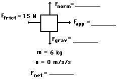**Fnet = 0 N; Fgrav = 58.8 N; Fnorm = 58.8 N;
Fapp = 15 N**

When the velocity is constant, a = 0 m/s/s and Fnet = 0 N

Since the mass is known, Fgrav can be found: Fgrav = m • g = 6 kg • 9.8
m/s/s = 58.8 N

Since there is no vertical acceleration, the normal force equals the
gravity force.

Since there is no horizontal acceleration, Ffrict = Fapp = 15 N

A rightward force is applied to a 10-kg object to move it across a rough
surface at constant velocity. The coefficient of friction between the
object and the surface is 0.2. Use the diagram to determine the
gravitational force, normal force, applied force, frictional force, and
net force. (Neglect air resistance.)

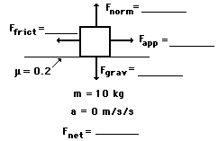**Fnet = 0 N; Fgrav = 98 N; Fnorm = 98 N;
Ffrict = 19.6 N; Fapp = 19.6 N**

When the velocity is constant, a = 0 m/s/s and Fnet = 0 N

Since the mass is known, Fgrav can be found (Fgrav = m • g = 10 kg • 9.8
m/s/s). Since there is no vertical acceleration, normal force = gravity
force. Once Fnorm is known, Ffrict can be found using Ffrict = \"mu\"
•Fnorm. Since there is no horizontal acceleration, Ffrict = Fapp = 19.6
N

A rightward force is applied to a 5-kg object to move it across a rough
surface with a rightward acceleration of 2 m/s/s. The coefficient of
friction between the object and the surface is 0.1. Use the diagram to
determine the gravitational force, normal force, applied force,
frictional force, and net force. (Neglect air resistance.)

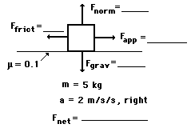**Fnet =10 N, right; Fgrav = 49 N; Fnorm = 49 N;
Ffrict = 4.9 N; Fapp = 14.9 N**

Fnet can be found using Fnet = m • a = (5 kg) • (2 m/s/s) = 10 N, right.

Since the mass is known, Fgrav can be found: Fgrav = m • g = 5 kg • 9.8
m/s/s = 49 N

Since there is no vertical acceleration, the normal force equals the
gravity force.

Once Fnorm is known, Ffrict can be found using Ffrict = \"mu\" • Fnorm =
(0.1) • (49 N) = 4.9 N.

Since the Fnet = 10 N, right, the rightward force (Fapp) must be 10 N
more than the leftward force (Ffrict); thus, Fapp must be 14.9 N.

A rightward force of 25 N is applied to a 4-kg object to move it across
a rough surface with a rightward acceleration of 2.5 m/s/s. Use the
diagram to determine the gravitational force, normal force, frictional
force, net force, and the coefficient of friction between the object and
the surface. (Neglect air resistance.)

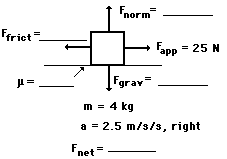**Fnet = 10 N, right; Fgrav = 39.2 N; Fnorm =
39.2 N; Ffrict = 15 N; \"mu\"= 0.383**

Fnet can be found using Fnet = m • a = (4 kg) • (2.5 m/s/s) =10 N,
right.

Since the mass is known, Fgrav can be found: Fgrav = m • g = 4 kg • 9.8
m/s/s = 39.2 N.

Since there is no vertical acceleration, the normal force equals the
gravity force.

Since the Fnet=10 N, right, the rightward force (Fapp) must be 10 N more
than the leftward force (Ffrict); thus, Ffrict must be 15 N.

Finally, \"mu\"= Ffrict / Fnorm = (15 N) / (39.2 N) = 0.383.

# Free Fall and Air Resistance

In addition to an exploration of free fall, the motion of objects that
encounter air resistance will also be analyzed. In particular, two
questions will be explored:

-   Why do objects that encounter air resistance ultimately reach a
    terminal velocity?

-   In situations in which there is air resistance, why do more massive
    objects fall faster than less massive objects?

To answer the above questions, [[Newton\'s second
law]{.underline}](http://www.physicsclassroom.com/Class/newtlaws/u2l3a.cfm) of
motion (Fnet = m•a) will be applied to analyze the motion of objects
that are falling under the sole influence of gravity (free fall) and
under the dual influence of gravity and air resistance.

** **

### ** **

### **Free Fall Motion**

As learned in an earlier unit, free fall is a special type of motion in
which the only force acting upon an object is gravity. Objects that are
said to be undergoing free fall, are not encountering a significant
force of air resistance; they are falling under the sole influence of
gravity. Under such conditions, [[all objects will fall with the same
rate of acceleration, regardless of their
mass]{.underline}](http://www.physicsclassroom.com/Class/1DKin/U1L5e.cfm).
But why? Consider the free-falling motion of a 1000-kg baby elephant and
a 1-kg overgrown mouse.

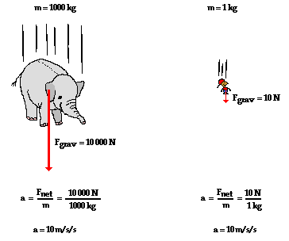\
 

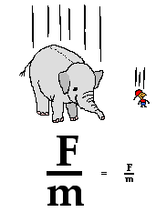If [[Newton\'s second
law]{.underline}](http://www.physicsclassroom.com/Class/newtlaws/u2l3a.cfm) were
applied to their falling motion, and if a [[free-body
diagram]{.underline}](http://www.physicsclassroom.com/Class/newtlaws/u2l2c.cfm) were
constructed, then it would be seen that the 1000-kg baby elephant would
experiences a greater force of gravity. This greater force of gravity
would have a direct effect upon the elephant\'s acceleration; thus,
based on force alone, it might be thought that the 1000-kg baby elephant
would accelerate faster. But acceleration depends upon two factors:
force and mass. The 1000-kg baby elephant obviously has more mass (or
inertia). This increased mass has an inverse effect upon the elephant\'s
acceleration. And thus, the direct effect of greater force on the
1000-kg elephant is offset by the inverse effect of the greater mass of
the 1000-kg elephant; and so each object accelerates at the same rate -
approximately 10 m/s/s. The ratio of force to mass (Fnet/m) is the same
for the elephant and the mouse under situations involving free fall.

This ratio (Fnet/m) is sometimes called the **gravitational field
strength** and is expressed as 9.8 N/kg (for a location upon Earth\'s
surface). The gravitational field strength is a property of the location
within Earth\'s gravitational field and not a property of the baby
elephant nor the mouse. All objects placed upon Earth\'s surface will
experience this amount of force (9.8 N) upon every 1 kilogram of mass
within the object. Being a property of the location within Earth\'s
gravitational field and not a property of the free falling object
itself, all objects on Earth\'s surface will experience this amount of
force per mass. As such, all objects free fall at the same rate
regardless of their mass. Because the 9.8 N/kg gravitational field at
Earth\'s surface causes a 9.8 m/s/s acceleration of any object placed
there, we often call this ratio the acceleration of gravity. 

Why does an object that encounters air resistance eventually reach a
terminal velocity? To answer this questions, [[Newton\'s second
law]{.underline}](http://www.physicsclassroom.com/Class/newtlaws/u2l3a.cfm) will
be applied to the motion of a falling skydiver.

In the diagrams below, free-body diagrams
showing the forces acting upon an 85-kg skydiver (equipment included)
are shown. For each case, use the diagrams to determine the net force
and acceleration of the skydiver at each instant in time. Then use the
button to view the answers.

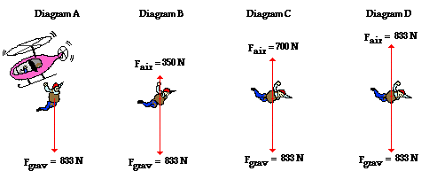** **

The **Fnet = 833 N, down** and the **a =9.8 m/s/s, down**

a = (Fnet / m) = (833 N) / (85 kg) = 9.8 m/s/s

The **Fnet = 483 N, down** and the **a = 5.68 m/s/s, down**

a = (Fnet / m) = (483 N) / (85 kg) = 5.68 m/s/s

The **Fnet = 133 N, down** and the **a = 1.56 m/s/s, down**

a = (Fnet / m) = (133 N) / (85 kg) = 1.56 m/s/s

The **Fnet = 0 N** and the **a = 0 m/s/s**

a = (Fnet / m) = (0 N) / (85 kg) = 0 m/s/s.

Lesson 4 - Newton\'s Third Law of Motion

-   Newton\'s Third Law

-   [Identifying Interaction Force
    Pairs](https://www.physicsclassroom.com/class/newtlaws/Lesson-4/Identifying-Action-and-Reaction-Force-Pairs)

# Newton\'s Third Law

# According to Newton, whenever objects A and B interact with each other, they exert forces upon each other. When you sit in your chair, your body exerts a downward force on the chair and the chair exerts an upward force on your body. There are two forces resulting from this interaction - a force on the chair and a force on your body. These two forces are called action and reaction forces and are the subject of Newton\'s third law of motion. Formally stated, Newton\'s third law is:

> **For every action, there is an equal and opposite reaction.**

The statement means that in every interaction, there is a pair of forces
acting on the two interacting objects. The size of the forces on the
first object [equals]{.underline} the size of the force on the second
object. The direction of the force on the first object
is [opposite]{.underline} to the direction of the force on the second
object. Forces [always]{.underline} come in pairs - equal and opposite
action-reaction force pairs. 

### **Formula:**

### **Examples of Interaction Force Pairs**

A variety of action-reaction force pairs are
evident in nature. Consider the propulsion of a fish through the water.
A fish uses its fins to push water backwards. But a push on the water
will only serve to accelerate the water. Since forces result from mutual
interactions, the water must also be pushing the fish forwards,
propelling the fish through the water. The size of the force on the
water equals the size of the force on the fish; the direction of the
force on the water (backwards) is opposite the direction of the force on
the fish (forwards). For every action, there is an equal (in size) and
opposite (in direction) reaction force. Action-reaction force pairs make
it possible for fish to swim.

1\. While driving down the road, a firefly strikes the windshield of a
bus and makes a quite obvious mess in front of the face of the driver.
This is a clear case of Newton\'s third law of motion. The firefly hit
the bus and the bus hits the firefly. Which of the two forces is
greater: the force on the firefly or the force on the bus?** **

** **Trick Question! Each force is the same size. For every action,
there is an equal \... (equal!). The fact that the firefly splatters
only means that with its smaller mass, it is less able to withstand the
larger acceleration resulting from the interaction. Besides, fireflies
have guts and bug guts have a tendency to be *splatterable*. Windshields
don\'t have guts. There you have it.

2\. For years, space travel was believed to be impossible because there
was nothing that rockets could push off of in space in order to provide
the propulsion necessary to accelerate. This inability of a rocket to
provide propulsion is because \...

> a\. \... space is void of air so the rockets have nothing to push off
> of.
>
> b\. \... gravity is absent in space.
>
> c\. \... space is void of air and so there is no air resistance in
> space.
>
> d\. \... nonsense! Rockets do accelerate in space and have been able
> to do so for a long time.
>
> ** Answer: D**
>
> **I**t is a common misconception that rockets are unable to accelerate
> in space. The fact is that rockets do accelerate. There is indeed
> nothing for rockets to push off of in space - at least nothing which
> is external to the rocket. But that\'s no problem for rockets. Rockets
> are able to accelerate due to the fact that they burn fuel and push
> the exhaust gases in a direction opposite the direction which they
> wish to accelerate.

### 

3. Many people are familiar with the fact that a
rifle recoils when fired. This recoil is the result of action-reaction
force pairs. A gunpowder explosion creates hot gases that expand outward
allowing the rifle to push forward on the bullet. Consistent with
Newton\'s third law of motion, the bullet pushes backwards upon the
rifle. The acceleration of the recoiling rifle is \...

> a\. greater than the acceleration of the bullet.
>
> b\. smaller than the acceleration of the bullet.
>
> c\. the same size as the acceleration of the bullet.
>
>  **Answer: B**
>
> The force on the rifle equals the force on the bullet. Yet,
> acceleration depends on both force and mass. The bullet has a greater
> acceleration due to the fact that it has a smaller mass. Remember:
> acceleration and mass are inversely proportional.

 

 

5.  In the top picture (below), Kent Budgett is
    pulling upon a rope that is attached to a wall. In the bottom
    picture, Kent is pulling upon a rope that is attached to an
    elephant. In each case, the force scale reads 500 Newton. Kent is
    pulling ...

> a\. with more force when the rope is attached to the wall.
>
> b\. with more force when the rope is attached to the elephant.
>
> c\. the same force in each case.
>
> **Answer: C**

# Kent is pulling with 500 N of force in each case. The rope transmits the force from Kent to the wall (or to the elephant) and vice versa. Since the force of Kent pulling on the wall and the wall pulling on Kent are action-reaction force pairs, they must have equal magnitudes. 

# 

# Identifying Interaction Force Pairs

According to [[Newton\'s third
law]{.underline}](http://www.physicsclassroom.com/Class/newtlaws/u2l4a.cfm#third),
for every action force there is an equal (in size) and opposite (in
direction) reaction force. Forces always come in pairs - known as
\"action-reaction force pairs.\" Identifying and describing
action-reaction force pairs is a simple matter of identifying the two
interacting objects and making two statements describing who is pushing
on whom and in what direction. For example, consider the interaction
between a baseball bat and a baseball.

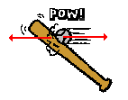\
 

The baseball forces the bat to the left; the bat forces the ball to the
right. Together, these two forces exerted upon two different objects
form the action-reaction force pair. Note that in the description of the
two forces, the nouns in the sentence describing the forces simply
switch places.

Consider the following three examples. One of the forces in the mutual
interaction is described; describe the other force in the
action-reaction force pair. Click the button to view the answer.

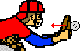Baseball pushes glove leftwards.

**Answer: **The glove pushes the baseball rightward.

Bowling ball pushes pin leftwards.

**Answer: **Pin pushes bowling ball rightward.

Enclosed air particles push balloon wall
outwards.

**Answer: **Balloon wall pushes enclosed air particles inwards.

1\. Consider the interaction depicted below between foot A, ball B, and
foot C. The three objects interact simultaneously (at the same time).
Identify the [two pairs]{.underline} of action-reaction forces. Use the
notation \"foot A\", \"foot C\", and \"ball B\" in your statements.

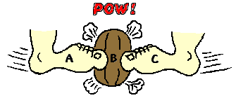

 The first pair of action-reaction force pairs is: foot A pushes ball B
to the right; and ball B pushes foot A to the left. The second pair of
action-reaction force pairs is: foot C pushes ball B to the left; and
ball B pushes foot C to the right.

2\. Identify at least six pairs of action-reaction force pairs in the
following diagram.

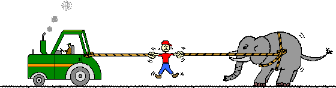

The elephant\'s feet push backward on the ground; the ground pushes
forward on its feet. The right end of the right rope pulls leftward on
the elephant\'s body; its body pulls rightward on the right end of the
right rope. The left end of the right rope pulls rightward on the man;
the man pulls leftward on the left end of the right rope. The right end
of the left rope pulls leftward on the man; the man pulls rightward on
the right end of the left rope. The tractor pulls leftward on the left
end of the left rope; the left end of the left rope pulls rightward on
the tractor. 

NEWTON'S LAW SUMMARY

1\. First Law (Law of Inertia):

An object at rest stays at rest, and an object in motion stays in motion
with the same speed and direction unless acted upon by an external
force.

Formula: F = 0 (when there is no net external force)

2\. Second Law (Law of Acceleration):

The acceleration of an object is directly proportional to the net force
applied to it and inversely proportional to its mass.

Formula: F = m\*a (Force equals mass times acceleration)

3\. Third Law (Action-Reaction Law):

For every action, there is an equal and opposite reaction.

Formula: F *action* = -F *reaction*

Types of Force:

1\. Applied Force:

Force applied to an object by a person or another object.

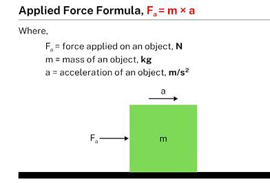 Formula:

2\. Gravitational Force:

Force of attraction between two masses due to gravity.

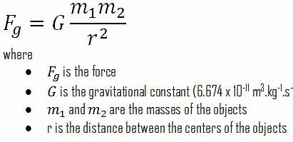 Formula:

3.  Normal Force:

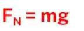 Perpendicular force exerted by a surface to
support an object resting on it.

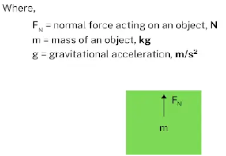 Formula:

4\. Frictional Force:

Force resisting the motion or tendency of motion between two surfaces.

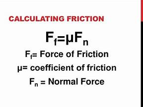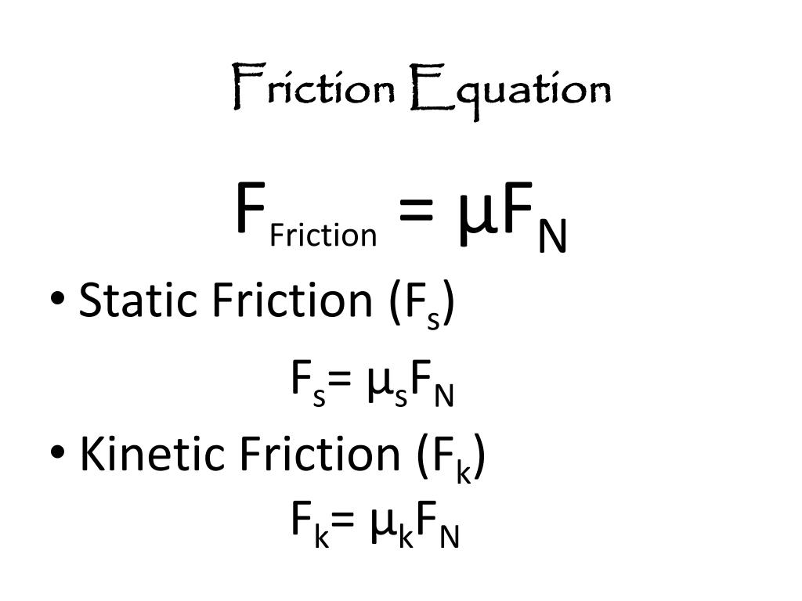 Formula:

5\. Air Resistance Force:

Force opposing the motion of an object through the air.

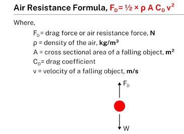 Formula:

6.  Tension Force:

Force transmitted through a string, rope, or cable when it\'s pulled
tight.

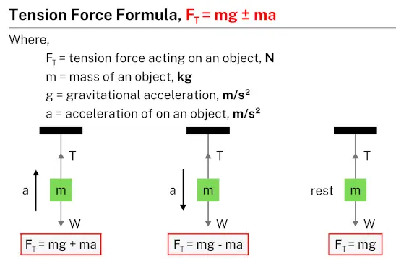 Formula:

Spring Force:

Force exerted by a spring when compressed or stretched.

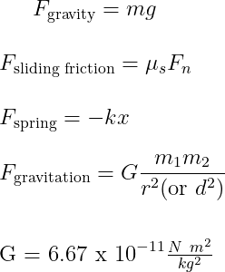 Formula:

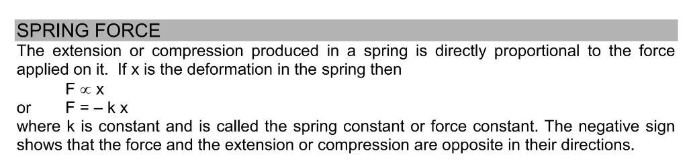
